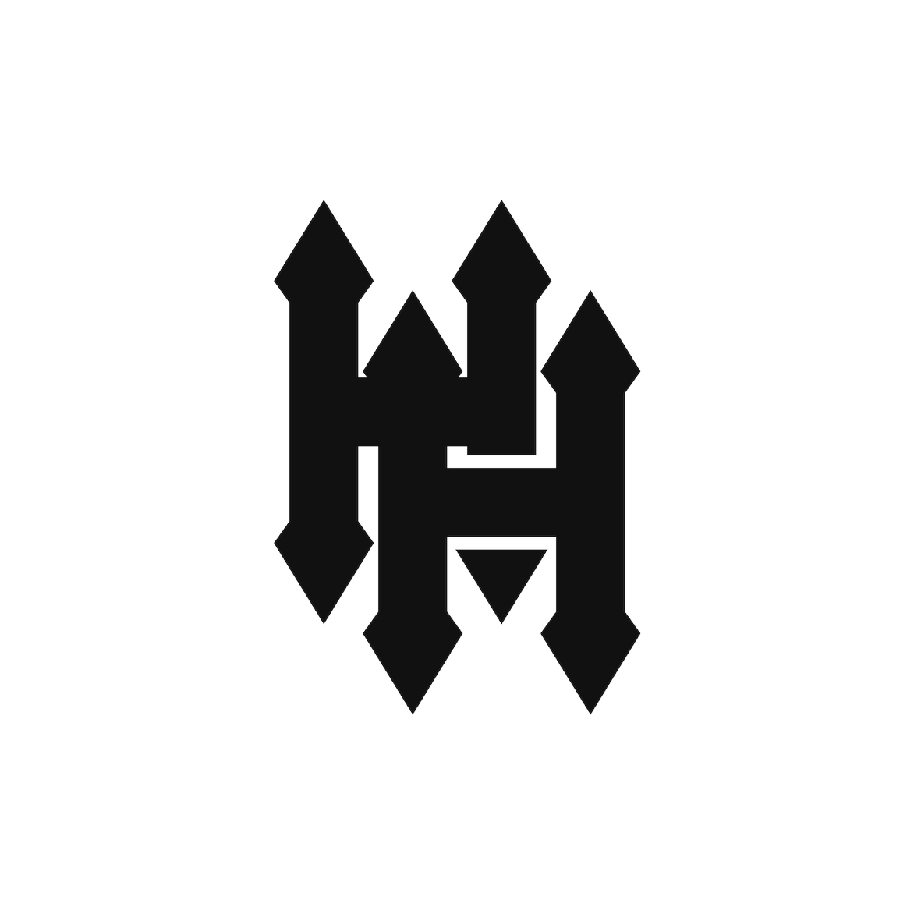
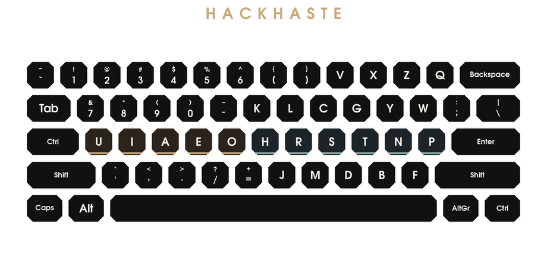
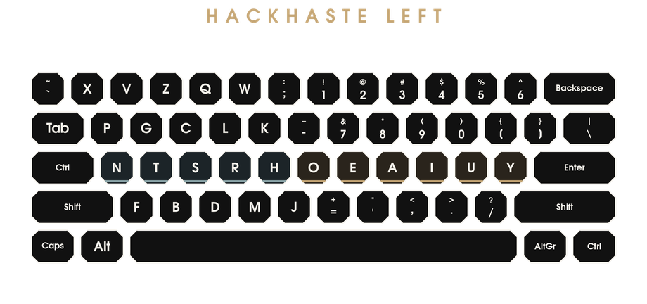

# HackHaste (HaHa)

[TRY IT NOW, WITHOUT INSTALL!](https://24kjvs.github.io/HackHaste/WEB/#try)

*Expedited Typing Across* **OS***es* *Integrated Natively Salvaging Home Rows*



Right-handed:


Left-handed:  


Version **0.2**. MIT License. Dr. Marcus Roe, [drm.cc](https://drm.cc/).

This file is the stoa to reveal the doctrine. The workshop (maps, modifiers, packages, every machine that can take the layout) is over in [HackHaste-MANUAL.md](HackHaste-MANUAL.md). The public site is [WEB/](WEB/). The finger phrases for every key are [LEARNING HACKHASTE/MNEMONICS.md](LEARNING%20HACKHASTE/MNEMONICS.md) (main) and [LEARNING HACKHASTE/MNEMONICS-LEFT.md](LEARNING%20HACKHASTE/MNEMONICS-LEFT.md) (left). The tutors that drill them are catalogued in [LEARNING HACKHASTE/LEARNING.md](LEARNING%20HACKHASTE/LEARNING.md).

---


## A Philosopher's Layout for Writers, Coders, and Hackers

> Judge every word and deed that are according to the Higher Nature to be fit for you; and do not be diverted by the blame which follows from any people, nor by their words, but if a thing is Good which is to be done or said, do not consider it unworthy of you.
>
> - Marcus Aurelius, *Meditations* 5.3


### On putting the alphabet back into English

It is a mark of the modern mind that it will rearrange the stars before it will put the milk next to the tea. QWERTY was a clever answer to a dead machine: it scattered the alphabet so that type-bars would not clash. We have kept the scatter and lost the machine. Colemak and Dvorak, being honest, put common letters under strong fingers, and then **split the native division in language of vowels across both hands**, as if a syllable were an inventory. HackHaste does the thing so obvious that it looks like a joke. HaHa!

There is a class of reformer who will not believe a door is a door until it has been a thesis. He approaches the a thing as he approaches what he is accustomed to working with: he will “balance the load,” “minimise travel,” “optimise the metric,” but at the end of his labours the vowels will remain still mostly in diaspora, and certainly undifferentiated. HackHaste is not that reform. HH notices what English was doing all along, and has the bad manners to say so. HaHa! < It's not obnoxious if it's just the name!

Regardless any attitudes, a syllable cannot be made to compromise with committees or any amount of tactile memory. The syllable is a series of **consonantal gestures containing some singular breath of the vowels**. Anyone who has heard a child say *ma* or *no* or *the* already possesses the science. QWERTY, being a machine for not jamming hammers, put *E* above the left middle finger and *T* above the left index, and then asked both hands to forget the difference between a cluster and a nucleus. 

Dvorak remembered the difference and then lined the vowels as `AOEUI`, which is great but out of tune. 

Colemak remembered the common letters and then **split the vowels**: `A` on the left, `E I O` on the right, so that while it handles many words much better than QWERTY, it still snags and mostly where it remained conformative to QWERTY. Colemak is indeed fast, something I can attest to as a user for well over a decade and a half. While it is true there is much less travel compared to QWERTY or other older layouts, I found myself tiring of its compromises. Colemak and Dvorak were half-measures, and something better could be found by not compromising.

HackHaste, in compromise with language and reality alone, lines the vowels as `U I A E O` **on the left home row**, and the consonants that most often occur as `H R S T N P` **on the right**. The left hand sings, with the vowels as a tuned choir. The right hand stops and starts the air, like a fine conductor.

**All five primary vowels sit on the left home row, in the order** `U I A E O`**.**
**The right home row is the consonant engine** `H R S T N P`**.**

The left hand therefore holds the *nucleus* of almost every English syllable, the digits a programmer actually types, and the stops of prose. The right hand holds the *clusters*. The two hands take turns because English takes turns, spinning upon this divide already.

The right hand is therefore the skeleton where the left is the flesh of prose, but when we move into code and data, the left hand also interfaces with the "mechanical suit" of structure and function.

That is the whole philosophy.

---


## The obvious arrangement

> Everything harmonises with me which is harmonious to thee, o created universe. Nothing for me is too early nor too late, which is in due time for thee.
>
> - Marcus Aurelius, *Meditations* 4.23

English is not a pile of letters. It is a pulse: consonant, vowel, consonant, vowel, vowel, consonant, conson. A layout that ignores that pulse may still be “ergonomic” in the way that a mouse is ergonomic covered in fur. HackHaste is ergonomic in the sense that it fits the human, the language, and the *work*. Expedience. Haste.


| Hand  | Home row                        | What that hand is for                                                              |
| ----- | ------------------------------- | ---------------------------------------------------------------------------------- |
| Left  | **U I A E O** (pinky → index)   | Vowels; digits `1-5` and `7-0`; comma, period, slash, quote, equals                |
| Right | **H R S T N P** (index → pinky) | The frequent consonants, including the English clusters TH, ST, NT, NS, RT, RS, TR |


`E T A O I N S H R` - the nine letters that are the bulk of English all live at the **home row**.

Physical Caps Lock is **Control** instead (on Macintosh, Darwin, iOS, Classic Mac, and NeXT, that pinky key is **Command**; Control stays in the corner). We need no key that shouts so close. We need a key that *commands*.

Digits `7 8 9 0` sit on the letter row above the left hand (where QWERTY kept Q W E R). The number row keeps `1-6`, and parks the rare letters `V X Z Q` and the brackets where a stretch is fine. You pay in reach when you write *quiz*; you pay nothing when you write *the*.

There is a left-hand (hand-swapped) variant for those whose right hand is the vowel hand.

There are also **Shift Lock** subvariants of both. Caps Lock is a timid lock: it shifts letters and leaves `1` as `1`. A typewriter **Shift Lock** is not timid. It holds Shift. Digits become symbols, comma becomes less-than, the whole board stands up. HackHaste already spent Caps on Control (Command on Apple), which is the right use of that key.

If this still looks strange, it is because the typewriter won a war against jammed hammers and then demanded a monument you grew up with. We have taken the hammers away. It is permitted, at last, to type English without saluting the typewriter. HackHaste is the layout that idolises the language itself, while also proving superior for coding and data.

---


## The new home is no parking lot

> Make for thyself a definition or description of the thing which is presented to thee, so as to see distinctly what kind of a thing it is in its substance, in its nudity, in its complete entirety.
>
> - Marcus Aurelius, *Meditations* 3.11

A good layout puts the common letters on the home row. Quite so. The common letters must not be treated as nine identical tokens, however. They are not. **E, T, A, O, I, N, S, H, R** are breaths and signs that English uses as the framework and tune of all words and grammar. In HackHaste they are all on the home row, but they are on their *correct sides in the correct positions*:

```
Left  pinky  ring  middle  index  index     Right index  index  middle  ring  pinky  pinky
      U      I     A       E      O               H      R      S       T     N      P
```

Roughly two-fifths of English letter-strokes are the five vowels. Those strokes, in this layout, **never leave the left home row as dedicated to that 40% in the typing of prose**. Roughly another third are H, R, S, T, N, P, and this is why it makes sense to devote the left hand to that 40% where the right hand can only rest upon about 33%; among them T alone is the commonest consonant in the language and sits on the right ring finger, which has nothing else of importance to do at home. Add the vowels to HRSTNP and you have, depending on the corpus, close to **three quarters of all letters struck without leaving home**. QWERTY’s home row (`A S D F G H J K L`) is worse than an embarrassment in comparison: it catches A and S and a little H, and then fills the stronger hand with J, K, L, and semi-colon, which is more than a giggle. Haha!

Percentages treated alone however are the last refuge of a layout that has not decided what a hand is *for*. A piano is not improved by putting every frequently used note on the middle of the keyboard if the melody and the accompaniment are thereby forced to use the same fingers. **Hand alternation on the vowel-consonant pulse is the speed.** Same-hand rolling on a *cluster* (ST, NT, TH, RS) is also speed. Same-hand stumbling from D to E to C on QWERTY, or from K to N or B to L on Colemak, is a man trying to clap ones fingers against the palm. In order to clap back, I used letter combination frequencies to design the best layout for the rows of keys, to minimise finger repeat and focus on the strongest fingers and the stonger hand, which ever that may be.

---


## What each finger is for

> If you undertake a role which is beyond your powers, you both disgrace yourself in that one, and at the same time neglect the role which you might have filled with success.
>
> - Epictetus, *Enchiridion* 37

The following is the main layout, ANSI, standard ten-finger home. “Up” means the row that QWERTY called QWERTY. “Down” means the row that QWERTY called ZXCV.

Home positions, left pinky to right pinky:

```
`~   1!   2@  3#  4$ 5% 6^ [{   ]}    v    x z q Backspace
Tab   7&   8*  9(   0) -_ k l    c    g    y w ; \
L-Ctrl U    I   A    E o   h R    S    T    N p Enter
      pnky ring midl indx   indx midl ring pnky
Shift   '    ,    .    / =+ j m    d    b    f  Shift
Caps  Meta  Alt SPAAAAAAAAAAAAAAACE  Alt  R-Ctrl  (etc)
```

**Left pinky.** Control (where Caps Lock used to squat); home **U**; up **7**; down **'** (apostrophe/quote); number-row and **1**. The weakest finger is given a vowel that is real but not tyrannical, the digit seven, the apostrophe of English possession, and the modifier that actually runs an editor. The modifier and a vowel without travel. 'SEVEN-Up to quote the ONE!'

**Left ring.** Home **I**; up **8**; down **comma,**; number-row **2**. I is a close vowel; the comma. The ring finger now does what a ring finger does in speech: it keeps time and identifies you. A close vowel and a stop. 'I EIGHT @ the Two Commas.' (I imagine a fine restaurant.)

**Left middle.** Home **A**; up **9**; down **period.**; number-row **3**. A is the open vowel; the period is the open air after a sentence. Putting the full stop on the vowel hand is logical. **Most English words end in a consonant**: T, N, S, D, R especially, all of them right-hand letters here. If the period lived among those consonants, every sentence would end with two right-hand strokes and a little stumble. The vowel hand that gave the syllable breath also ends the sentence. This is as much about poetry of language form as any coding. The most open vowel and the full stop under 3 and 9. 'A THIRD period of the NINTH degree.'

**Left index.** The strong left finger: home **E** and **O** (E is the heaviest letter in the language; O is not far behind); up **0** and **-**; down **/** and **=**; number-row **4** and **5**. For Pythagoras four was composed of ten elements, as per his tetractys. The two heaviest vowels and the girding of code, on the strongest left finger. 'So divide the Egg to subtract the gO0se and equate it with dirt.'

Here, between the hands now, is the whole fraud of the old number row exposed. Since the left hand owns the vowels, it is **free, in the same posture, to own the numbers, symbols, parentheses, and the punctuation**. The right hand need not move to type `2026`, nor to close or break up a sentence. A programmer does not need ten digits on a shelf above everything like a poorly thought out firmament. He needs his work to be within **the digits**. The `7 8 9 0` stand on the old QWERTY Q W E R. Combined with `1-6`, directly above, the left hand can type any number; date, port, version, count, or array indices **all alone from the home position**. The right hand may continue to hold a chord of S-T or N-D in the mind, or simply rest, which is also a kind of speed, as you prepare for the next word or line. I should also point out here how parentheses and brackets belong to the right and left indices and middles of each hand respectively. Angle brackets to the middle and ring of the left.

**Right index.** Home **H** and **R** (H remains on its QWERTY key: even a revolution should not move a Hill that is already in the right place); up **K** and **L**; down **J** and **M** (Mountain, too, stays as righteously homed). H and R are the rough and the wash. English *th*, *her*, *the*, *there*, *which*; the index finger of the right hand is in those words like a modern hammers that holds the next nail for you to set it in before hammering it down. H stays where English put it; R is the liquid in Latinate verbs and Germanic gravity. 'Realise oLd "HoMe" was Just a Kite.'

**Right middle.** Home **S**; up **C**; down **D**. C sits directly above S: a same-finger pair. S a consonant that bumps against nearly everything and so it was placed next to the fewest others on the homerow, SC happens but is not the most common, CS almost never. D one row down is still a neighbour of S at the turn of a plural, as any other consonant. The hiss, the affricate, and the past tense. 'Stay Calm, Dude.'

**Right ring.** Home **T**; up **G**; down **B**. T is given a finger of its own on home. QWERTY put T above the left index, where it quarrelled with R, F, G, B, and V. Here T is a specialist. G and B are the voiced stops of *go* and *be*; they are not rare enough for the number row and not common enough to evict T. T is the commonest consonant; it deserves a dedicated finger that does not also carry a vowel. 'VeGeTaBle.'

**Right pinky.** Home **N** and **P**; up **Y**, **W**, **;** and backslash; down **F**. N is the other common nasal; it stays home. P is the modest partner of it. F is down, which is fair: commoner than K, rarer than T. **V, X, Z, Q** are sent to the far right of the number row. A stretch that happens once a page or once a file is a bit of fun rather than a hassle. A stretch that happens once a word or once a line of code is a vice. Some might call this an heroic deed but it was 'No Problem, You're Welcome, Friend. Xeno Zenith Questions.'

Another note: On the far left of the right hand, you will find the cursor movement keys for vim, on the far right, for emacs; both properly oriented. This is reversed but still present in the left hand variants.

So now that you are done with the porch, the front door is here: [LEARNING HACKHASTE/MNEMONICS.md](LEARNING%20HACKHASTE/MNEMONICS.md) and here [LEARNING HACKHASTE/MNEMONICS-LEFT.md](LEARNING%20HACKHASTE/MNEMONICS-LEFT.md). Instructions for GNU Typist, KTouch, Klavaro, and the rest of the tutors are in [LEARNING HACKHASTE/LEARNING.md](LEARNING%20HACKHASTE/LEARNING.md). Let me know if I missed anything.


---

